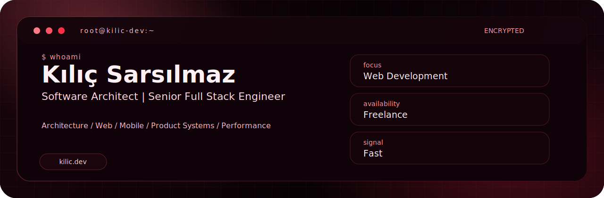
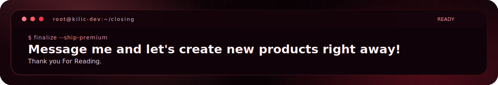

  

<h1 align="center" style="border-bottom: none;">Kılıç Sarsılmaz</h1>

  
  
  
  
  
  
  
  
  
  

  
  
  
  
  
  
  
  
  
  

  
  
  
  
  
  
  
  
  
  

  
  
  
  
  
  
  
  
  
  
  
  

  

